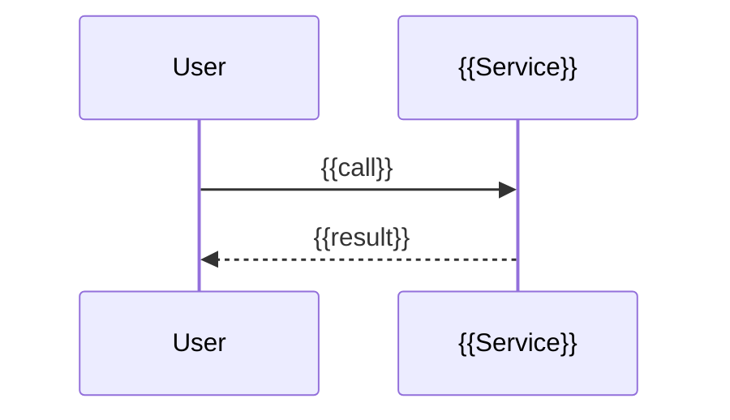

# {{Module}}: flows

Only flows that deserve a diagram. A CRUD does not.

## {{Flow name}}

{{One sentence: when this flow runs.}}

```mermaid
stateDiagram-v2
  [*] --> {{State}}
  {{State}} --> {{Other}}: {{event}}
```


